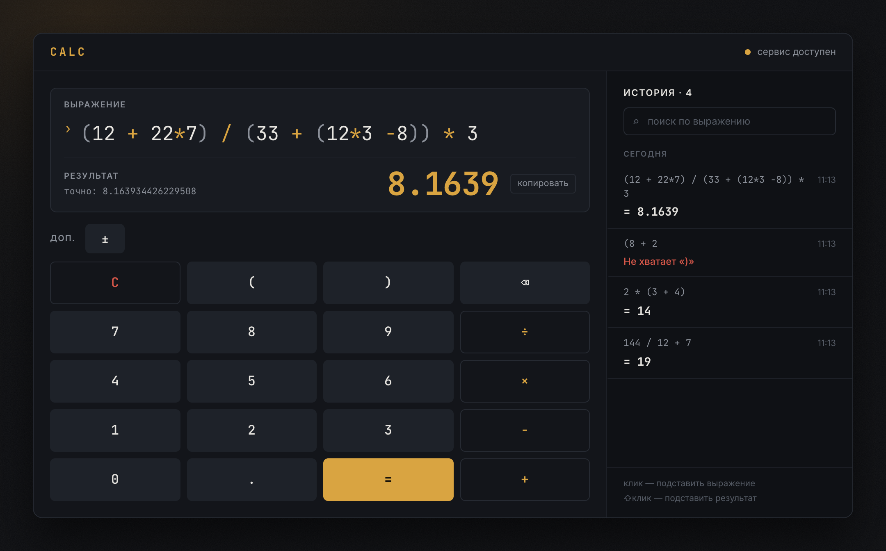

# Calculator Service — Sprint 0

Учебное веб-приложение для вычисления арифметических выражений. React-клиент
отправляет выражение во Flask API, backend безопасно вычисляет результат и
сохраняет историю текущего браузера в SQLite.



## Итог работы

В проекте реализованы:

- интерфейс калькулятора с вводом с клавиатуры и экранными кнопками;
- числа, скобки, операции `+`, `-`, `*`, `/` и унарные знаки;
- обработка пустого, некорректного и слишком длинного ввода;
- понятная ошибка при делении на ноль;
- сохранение успешных вычислений в SQLite;
- отдельная история для каждого браузера по cookie `calculator_user_id`;
- повторный выбор выражения из истории;
- 127 backend-тестов и автоматический запуск Pytest в GitHub Actions.

## Технологии

| Часть | Технологии |
|---|---|
| Backend | Python 3.12, Flask, Flask-CORS |
| Вычислитель | собственный рекурсивный parser |
| База данных | SQLite, Flask-SQLAlchemy |
| Frontend | React 19, Vite, Axios, CSS |
| Тесты и CI | Pytest, GitHub Actions |

## Как работает проект

```text
Браузер с React :5173
        |
        | POST /api/v1/calculate
        | GET  /api/v1/history
        v
Flask API :5000
        |-- проверка и разбор выражения
        |-- идентификация клиента по cookie
        `-- repository --> SQLite
```

1. Frontend отправляет введённое выражение в `POST /api/v1/calculate`.
2. Backend проверяет длину и синтаксис, затем parser вычисляет результат.
3. Успешный результат сохраняется через repository в SQLite.
4. Flask устанавливает случайную cookie, по которой определяется история
   конкретного браузера.
5. Frontend получает историю через `GET /api/v1/history` и показывает её рядом
   с калькулятором.

Файл базы `instance/calculator.db` создаётся автоматически при первом запуске
backend и не добавляется в Git.

Подробный контракт запросов находится в [`docs/api.md`](docs/api.md), описание
слоёв приложения — в [`docs/architecture.md`](docs/architecture.md).

## Структура проекта

```text
backend/
  app/
    api/             # HTTP endpoints
    models/          # SQLAlchemy models
    repositories/    # работа с SQLite
    services/        # parser и идентификация клиента
  run.py
frontend/
  src/
    api/             # Axios-клиент
    components/      # компоненты интерфейса
    hooks/           # состояние backend и истории
tests/               # backend-тесты Pytest
docs/                # архитектура и API-контракт
.github/workflows/   # проверка backend в GitHub Actions
```

## Необходимые программы

- Python 3.12;
- Node.js версии 20.19 или новее вместе с npm;
- Git — только для клонирования и работы с репозиторием.

Проверить установку можно командами:

```text
python --version
node --version
npm --version
git --version
```

## Запуск на Windows

Все команды backend выполняются из корня репозитория.

### 1. Подготовить Python

```powershell
py -3.12 -m venv .venv
.\.venv\Scripts\python.exe -m pip install --upgrade pip
.\.venv\Scripts\python.exe -m pip install -r requirements-dev.txt
```

Виртуальное окружение создаётся только один раз. Активация PowerShell не
обязательна: команды ниже напрямую используют Python из `.venv`.

### 2. Запустить backend

```powershell
.\.venv\Scripts\python.exe -m backend.run
```

Backend будет доступен по адресу `http://127.0.0.1:5000`. Проверка:

```powershell
Invoke-RestMethod http://127.0.0.1:5000/api/v1/health
```

Ожидаемый ответ: `{"status":"ok"}`.

### 3. Запустить frontend

Откройте второе окно PowerShell, перейдите в корень проекта и выполните:

```powershell
cd frontend
npm ci
npm run dev
```

Откройте `http://127.0.0.1:5173`. Во время разработки Vite автоматически
перенаправляет запросы `/api` на Flask. Локальный `.env` не нужен.

Повторно устанавливать зависимости не требуется. При следующих запусках
достаточно запустить backend и выполнить `npm run dev` в папке `frontend`.

## Запуск и сборка на Linux

Для Debian/Ubuntu Python можно подготовить так:

```bash
sudo apt update
sudo apt install python3 python3-venv python3-pip
```

Node.js с npm устанавливается отдельно. Требуется Node.js 20.19 или новее.

### 1. Подготовить и запустить backend

Из корня репозитория:

```bash
python3 -m venv .venv
source .venv/bin/activate
python -m pip install --upgrade pip
python -m pip install -r requirements-dev.txt
python -m backend.run
```

### 2. Запустить frontend

Во втором терминале, также из корня репозитория:

```bash
cd frontend
npm ci
npm run dev
```

Приложение откроется по адресу `http://127.0.0.1:5173`.

### 3. Собрать frontend

```bash
cd frontend
npm ci
npm run build
```

Готовые статические файлы появятся в `frontend/dist/`. Для совместной локальной
работы frontend и backend используется `npm run dev`, потому что именно режим
разработки содержит настроенный proxy на Flask.

## Запуск тестов

Windows, из корня проекта:

```powershell
.\.venv\Scripts\python.exe -m pytest
```

Linux, с активированным виртуальным окружением:

```bash
python -m pytest
```

Тесты проверяют parser, API, обработку ошибок, SQLite, cookie, разделение
истории между клиентами и сохранение истории после перезапуска. Рабочая база
при тестировании не изменяется.

## Быстрая ручная проверка

После запуска обеих частей приложения:

1. Вычислить `2 + 2`.
2. Проверить выражение `(12 + 22 * 7) / (33 + (12 * 3 - 8)) * 3`.
3. Ввести `1 / 0` и убедиться, что показана ошибка.
4. Обновить страницу и проверить, что успешные вычисления остались в истории.
5. Открыть приватное окно браузера и убедиться, что его история пустая.
